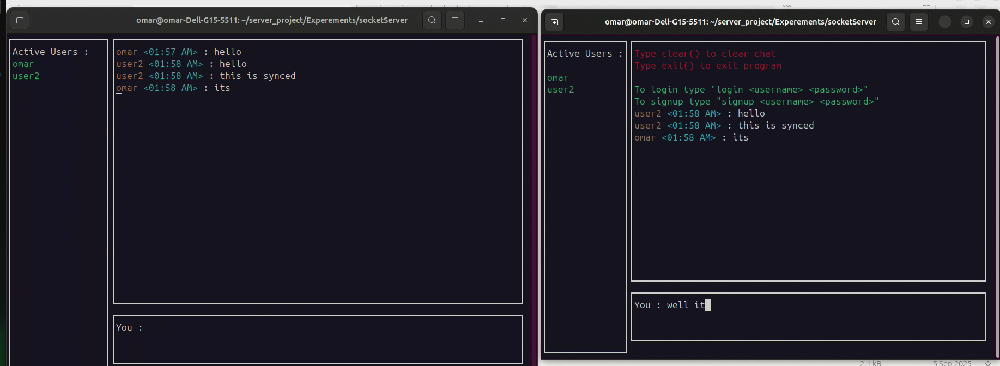

# Multithreaded TCP chat server in C with ncurses-based terminal GUI

A real-time TCP group chat server and client built entirely in C, using pthreads, sockets, and an ncurses GUI.
This project demonstrates how to handle multiple clients concurrently with threads while being thread safe with mutex and correct handling, it lets you create a group chat or join one on a specific ip and port

## Features

- **Multithreaded Server**: The server can handle multiple users concurrently using threads and log in or signup each one
- **Custom Messaging Protocol**: Implemented Length-prefixed protocol to handle TCP connections more safely
- **Ncurses-Based GUI**: Implemented Real-time chat GUI using Ncurses library for the client side
- **Session Management**: Implemented basic signup and login functionality

---

## 🚀 Quick Start

1. Clone the repository:
   ```bash
   git clone https://github.com/Omar-2718/Multithreaded-TCP-chat-server-in-C.git
   ```

2. Make sure **ncurses** is installed


3. Build the server:
   ```bash
   gcc server.c common.c database.c session.c vector.c  -o server -lpthread
   ```

4. Build the client:
   ```bash
   gcc client.c common.c session.c vector.c  -o client -lpthread -lncurses
   ```

4. Run the server:
   ```bash
   ./server
   ```

4. Run and connect via the client:
   ```bash
    ./client
   ```

---


## 📚 Usage Guide
- Start the server, then connect clients.

- Use `signup <username> <password>` or `login <username>   <password>` to join.

- Type messages to broadcast to all connected users.
<br>
- On the server console:
- Press `w` → Show connected users.

- Press `q` → Shut down the server.
## 🌟 Demonstrations

### 1. Creating a server


### 2. Running the app



## 👥 Contributing

Feel free to open issues or pull requests for bug fixes, new features, or improvements.